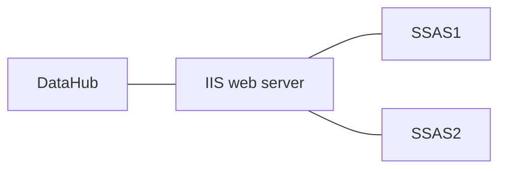
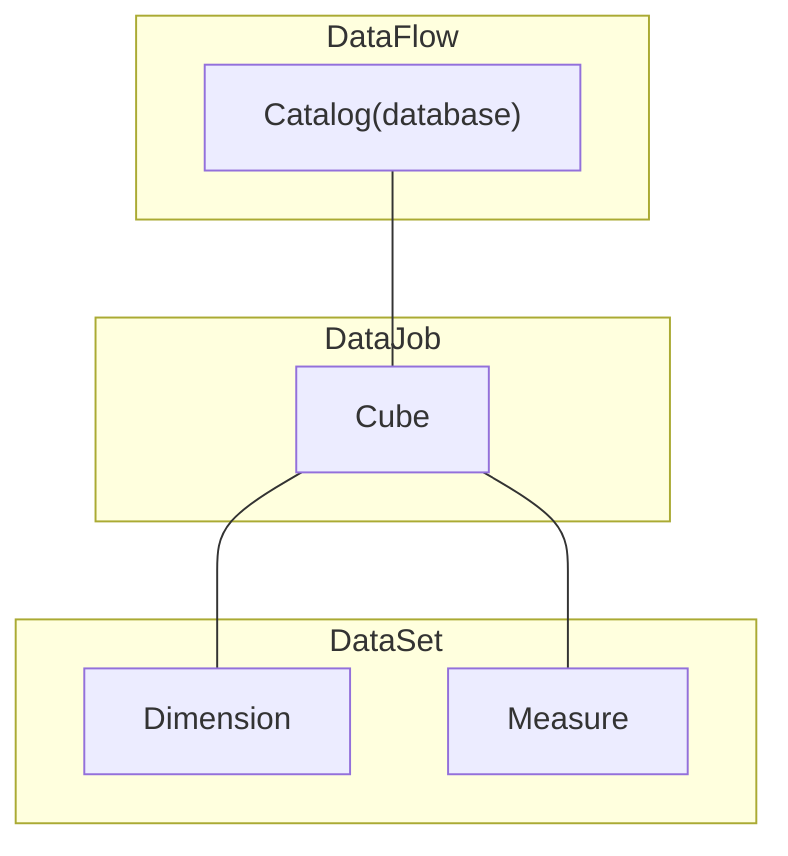

- Start Date: (2013-09-01)
- RFC PR: (after opening the RFC PR, update this with a link to it and update the file name)
- Discussion Issue: (None)
- Implementation PR(s): (leave this empty)

# SSAS Ingestion Module

## Summary

Adding the functionality of ingesting MSSQL OLAP metadata into DataHub is to provide a more comprehensive view of the data landscape and enable better data discovery and analysis.
The company I work for has developed an MVP ingestion module that caters to both tabular and multidimensional SSAS. We are considering contributing it to Datahub, but I have a couple of questions about the process.

## Motivation

By ingesting OLAP metadata from MSSQL, DataHub can provide users with a better understanding of the data stored in MSSQL OLAP cubes, including information about dimensions, hierarchies, measures, and calculations. 

Ingesting MSSQL OLAP metadata into DataHub can help improve data governance and data quality. Metadata can be used to build full data lineage, improve data discovery and analysis. By having a centralized view of the OLAP metadata, DataHub can help ensure that data is being used correctly and consistently across the organization.

## Requirements

- Ingestion metadata from SSAS Tabular models
- Ingestion metadata from SSAS Multidimensional models

### Extensibility

- Build lineage to/from SSAS models

## Detailed design

General information about [OLAP cubes](https://learn.microsoft.com/en-us/system-center/scsm/olap-cubes-overview?view=sc-sm-2022).

The interaction with SSAS (SQL Server Analysis Services) is carried out through [Microsoft's solution](https://learn.microsoft.com/en-us/analysis-services/instances/configure-http-access-to-analysis-services-on-iis-8-0?view=asallproducts-allversions).

Arguments in favor of such a solution:
- Cross-platform compatibility.
- A single, standardized entry point for working with SSAS.

General scheme.

Data exchange occurs using XMLA queries wrapped in HTTP.
- For multidimensional SSAS servers, a [DISCOVER_XML_METADATA](https://learn.microsoft.com/en-us/openspecs/sql_server_protocols/ms-ssas/51647299-75c7-471d-896f-a691e4114b18) type query is used.
- For tabular SSAS servers, [DMV](https://learn.microsoft.com/en-us/analysis-services/instances/use-dynamic-management-views-dmvs-to-monitor-analysis-services?view=asallproducts-allversions) (Dynamic Management View) queries are utilized.

The following scheme was proposed for entity mapping:

## How we teach this

We should create/update user guides to educate users for:
 - Search & discovery experience (how to find a SSAS models in DataHub)
 - Lineage experience (how to find different entities connected to the SSAS models)

## Rollout / Adoption Strategy

If it will be standalone module only who want will use it. So we no need any migration tools and braking changes. 

## Future Work

Establish a complete data lineage from the data source to the analytical models.

## Unresolved questions

- It would be better to create this module as a standalone, focusing solely on SSAS, or should it be integrated into the existing Mssql module?
- Is it relevant to add SSAS entities (catalog, cube, dimension, measure) to the DataHub?
- Does the proposed communication method with SSAS align with the project's needs?
- Does the proposed entity mapping approach for SSAS entities suit the project's requirements?