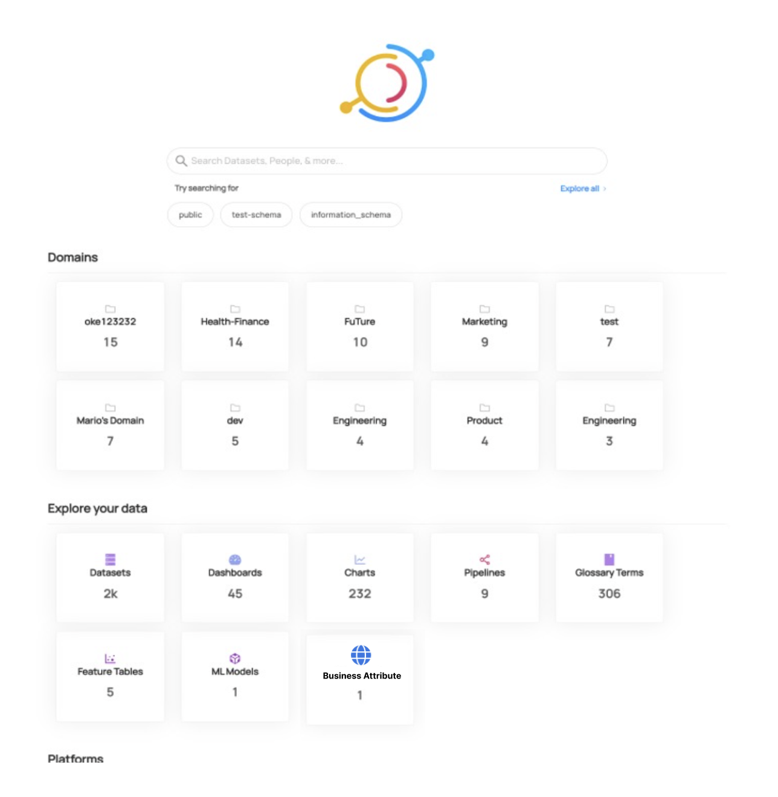
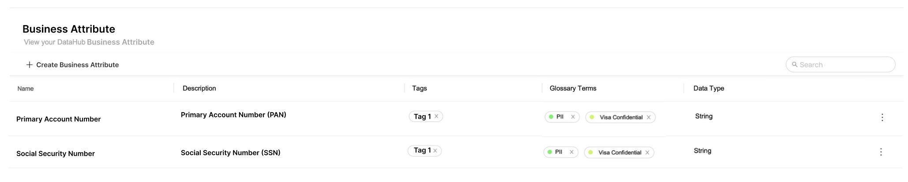
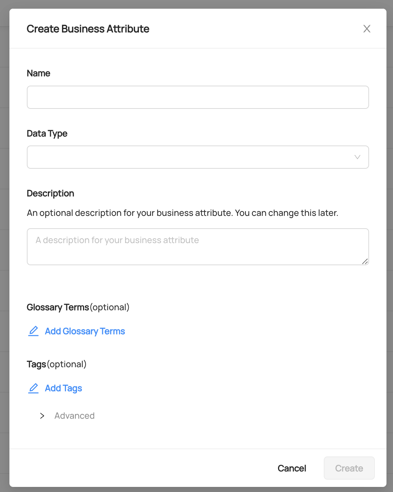
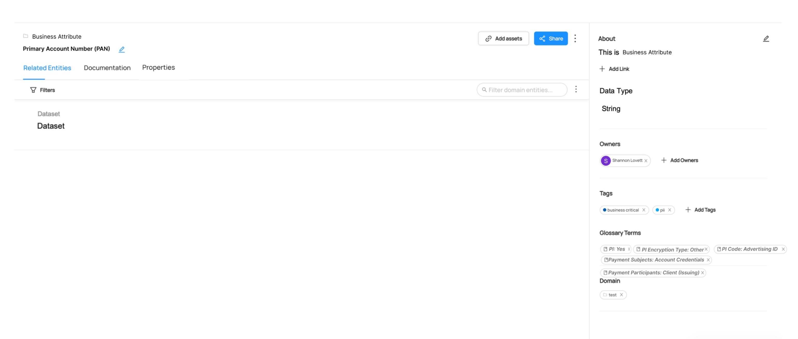
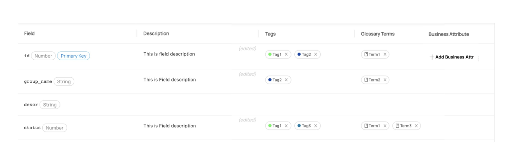
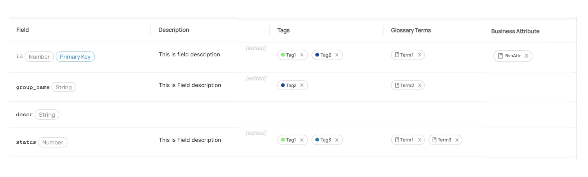
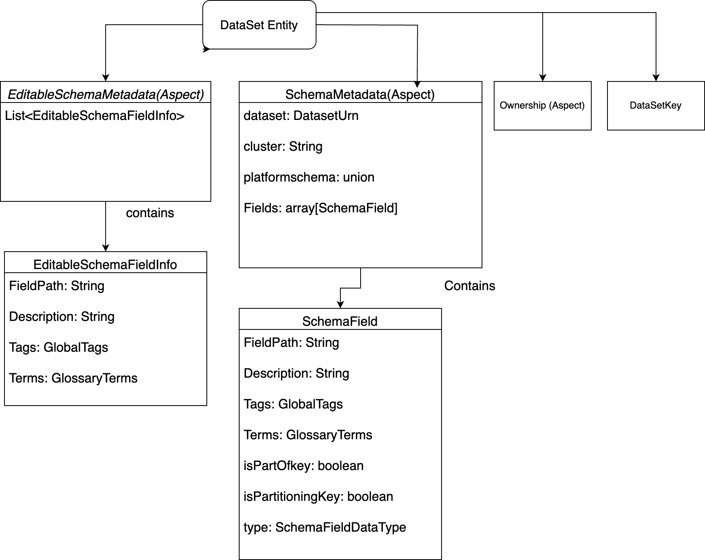
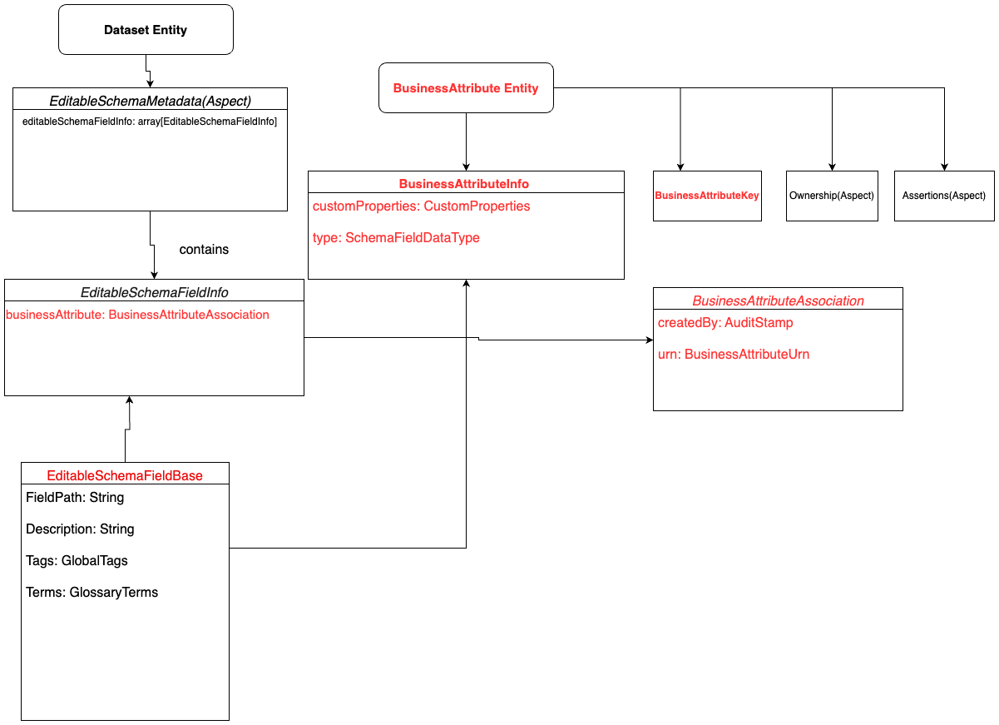
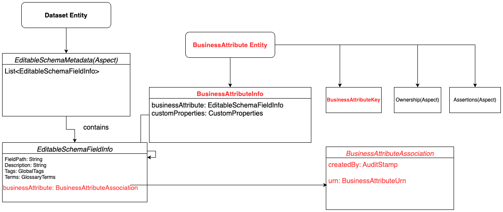
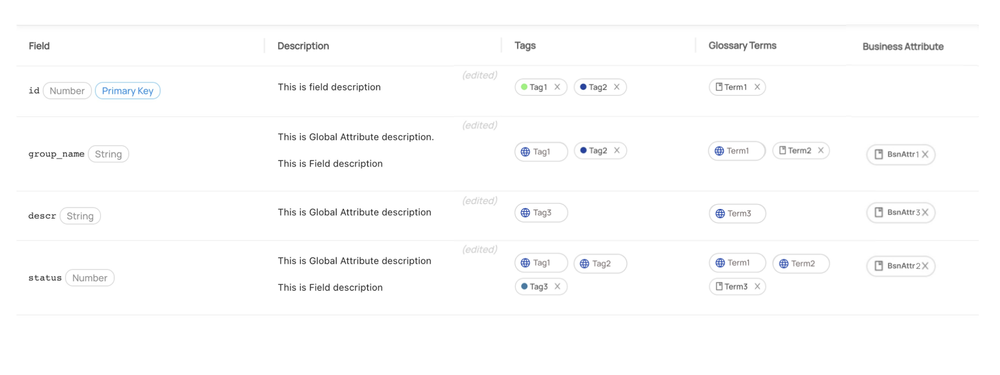

- Start Date: 2023-10-19
- RFC PR: 000-business-attributes.md
- Discussion Issue: 
- Implementation PR(s):

# Business Attributes

## Summary

A Business attribute is a centrally managed logical field that represents a unique schema field entity. This common construct is global in nature, i.e. it is not bound to a project or application implementation. Instead, its identity exists in representing the same field across various datasets owned by various different projects and applications. Projects or applications use the Business attribute to model a column in a dataset and inherit information about it such as definitions, data type, data quality rules/assertions, tags, glossary terms etc from the global definition. Data architects can use the concept of the business attribute to validate whether applications are conformant with the applicable metadata defined for the business attribute. By abstracting common business metadata into a logical model, different personas with appropriate business knowledge can define pertinent details, like rich definition, business use for the attribute, classification (i.e. PII, sensitive, shareable etc.), specific data rules that govern the attribute, connection to glossary terms.

## Motivation

* Improve the metadata definition, consistency, and meaning for commonly used attributes across applications / data systems in the organisation.
* Business users/consumers can easily discover datasets they are looking for  with the help of business attributes
* Add the ability to define data rules to govern the data in this attribute across applications


## Requirements

The primary personas involved in this are the Data Architect, Dataset Owner and Business User personas

### Data Architect

#### Must Haves
1. Ability to define a business attribute, and associate a description, datatype, glossary terms, tags and DQ rules among other aspects of a general field
2. Ability to update a business attribute record centrally
3. Ability to track any discrepancies between business attributes and associated fields

#### Good-to-Haves
1. Approval workflow for creation/updation

### Dataset Owner

#### Must Haves
1. Ability to inherit all attributes from a business attribute to a field by attaching the business attribute to the field
1. Ability to inherit all updates from a business attribute to a field

#### Good-to-Haves

1. Ability to intelligently inherit attributes from business attributes to fields in datasets via system auto-assignment

### Business User

#### Must Haves
1. Ability to search for fields using business description/tags/glossary attached to business attribute


## Non-Requirements
*  Allow dataset owners to propose changes to business attributes
* Allow dataset owners to partially inherit from business attributes (eg only inherit description but not tags)
* Allow fields to have multiple business attributes
* Update descriptions in data sources

## Detailed design

### Sample Mockups

#### Show Business Atrribute Launcher 


#### List Business Atrributes


#### Create Business Attribute  


#### Business Attribute Details


#### Enrich Schema
Current feature of enriching the schema field of dataset remains as it is



#### Attaching Business Attribute


#### Metadata Model Enhancements

Below are the current Relationships of Dataset Entity with its aspects in Datahub.




### Model Business Attribute Entity

We are proposing to introduce a new entity `BusinessAttribute`, which will use a new Aspect `BusinessAttributeInfo`. This new entity will be a top level entity to allow it to be defined and controlled independently by the business team.

User can able to attach `Business Attributes` only to `Schema Fields`. We will make necessary UI changes to control this feature.

New `BusinessAttributeInfo` aspect contains existing `EditableSchemaFieldInfo` record type and also `customProperties`.  Also we are introducing one new record type, `PhysicalEditableSchemaFieldInfo` which includes existing `EditableSchemaFieldInfo`. As per this implementation, existing aspect `EditableSchemaMetadata` now contains a list of `PhysicalEditableSchemaFieldInfo` records instead of `EditableSchemaFieldInfo` records.

Each `PhysicalEditableSchemaFieldInfo` will contain an `EditableSchemaFieldInfo` and the new field "`businessAttribute`" to represent the link between dataset schema field and business attribute. We are also proposing the introduction of a new field, "`type`", in `EditableSchemaFieldInfo`.

### URN Representation for Business Attribute


```
urn:li:businessAttribute:b3916dfe-a27c-4916-97be-60773dca90d7
```

###  Business Attribute Attachment to SchemaField
When the user attaches a business attribute to the corresponding schema field, the link will be represented by the business attribute id in the `PhysicalEditableSchemaFieldInfo` for Dataset. 

Any changes made to business attribute will be reflected on dataset details page on the fly. Also, delinking the business attribute from the schema field is implemented by simply removing the business attribute reference.

### Metadata Graph

#### Enabling Capability of searching Dataset entities as per Description/tags of Business Attributes

We are proposing to introduce new annotation "`@SearchableRef`", through which we can populate the elastic indexes with expanded details regarding the referenced entity.

For example, in "`PhysicalEditableSchemaFieldInfo`" we are referencing `businessAttribute` entity which can be annotated with `@SearchableRef`, which instructs relevant hooks to populate the index `datahubindex_v2` in Elasticsearch with the details of the `businessAttribute` and enables search of dataset as per properties of the `businessAttribute`. Below is the expected structure of `datasetindex_v2` after business attribute linked with `schemaField`.

```json 
{
    "took": 0,
    "timed_out": false,
    "_shards": {
        "total": 1,
        "successful": 1,
        "skipped": 0,
        "failed": 0
    },
    "hits": {
        "total": {
            "value": 1,
            "relation": "eq"
        },
        "max_score": 0.6931471,
        "hits": [
            {
                "_index": "datasetindex_v2",
                "_id": "urn%3Ali%3Adataset%3A%28urn%3Ali%3AdataPlatform%3Apostgres%2Cpostgres.public.orders%2CPROD%29",
                "_score": 0.6931471,
                "_source": {
                    "urn": "urn:li:dataset:(urn:li:dataPlatform:postgres,postgres.public.orders,PROD)",
                    "removed": false,
                    "container": "urn:li:container:a208486b83be39fa411922e07701d984",
                    "hasContainer": true,
                    "typeNames": [
                        "Table"
                    ],
                    "runId": [
                        "postgres-2023_09_29-12_54_35",
                        "postgres-2023_09_29-12_55_29",
                        "postgres-2023_09_29-12_55_41"
                    ],
                    "customProperties": [],
                    "name": "orders",
                    "hasDescription": false,
                    "fieldPaths": [
                        "order_id",
                        "user_id",
                        "product_id",
                        "quantity",
                        "order_date"
                    ],
                    "fieldGlossaryTerms": [],
                    "fieldDescriptions": [],
                    "fieldLabels": [],
                    "fieldTags": [],
                    "origin": "PROD",
                    "id": "postgres.public.orders",
                    "platform": "urn:li:dataPlatform:postgres",
                    "browsePaths": [
                        "/prod/postgres/postgres/public"
                    ],
                    "hasGlossaryTerms": false,
                    "glossaryTerms": [],
                    "editedFieldBusinessAttribute": [],
                    "editedFieldGlossaryTerms": [
                        "urn:li:glossaryTerm:5fb9fd4e-5ed2-46e9-afa2-6ab5bb1f4851"
                    ],
                    "editedFieldBusinessAttributev2": [
                        "urn:li:businessAttributev2:first-attribute",
                        "urn:li:businessAttributev2:second-attribute"
                    ],
                    "editedFieldDescriptions": [
                        "lorem ipsume and order\\_id and testing\n\n ",
                        "lorem ipsum",
                        " quantiy-loremipsume",
                        "this is product id",
                        "order\\_date-loremipsum wiht lot of love and testing and more love"
                    ],
                    "editedFieldTags": [
                        "urn:li:tag:TestTag",
                        "urn:li:tag:TestTag",
                        "urn:li:tag:TestTag"
                    ],
                    "businessAttributeGlossary": [
                        "urn:li:glossaryTerm:5fb9fd4e-5ed2-46e9-afa2-6ab5bb1f4851",
                        "urn:li:glossaryTerm:2b441fe5-c466-479a-8ce7-5b3f2db7ce1a"
                    ],
                    "businessAttributeTags": [
                        "urn:li:tag:TestTag",
                        "urn:li:tag:TestTag"
                    ],
                    "businessAttributeDescription": [
                        " quantiy-loremipsume",
                        " productLoremipsume"
                    ]
                }
            }
        ]
    }
}
```

#### Cascade changes made in Business Attribute to related Datasets

When any changes made to referenced entity, in this case Business attribute, for example, removal/add of tag/glossary-terms or description update, these changes needs to be cascaded to attached dataset elastic index. For this we are proposing to create either new annotation or using "`@SearchableRef`" with incoming and outgoing references like "`@Relationship`" entity, but under the hood we are planning to use "`@Relationship`" to fetch attached dataset entities and update their corresponding elastic indexes as per the changes made in referenced entity.


## How we teach this

For technical users, the concept of business attribute is best understood as user-defined abstract schema fields. In this context, anyone in the technology space can visualize it as the abstract record which can be inherited from by the implementation record, which is the actual physical schema field.

For architects, these are best understood as field templates. They define a template for a field by assigning metadata to each field which corresponds to a specification.

They are meant to be entirely transparent to business users and as such should not need to be introduced to them.

While the change doesn't fundamentally alter any existing Datahub concept, it greatly empowers users and acts as an accelerator to enrichment. As such, it should be taught as a fundamentally new concept which can be leveraged by large Datahub customers to greatly reduce their metadata management overhead.

## Drawbacks

Cascading changes made in Business Attribute to related Dataset elastic indexes put a load on Kafka and elastic. Changes made in business attribute results in Kafka events, which gets consumes by the consumer which in turn update the elastic indexes of the referenced dataset with the updated changes of business attribute.  As per current implementation, Kafka consumer finalise the message processing until it updates the elastic index, so for example, if business attribute is referenced in datasets(order of 100K), then processing large volumes of messages can lead to performance degradation.

Also, if the consumer fails to update the elastic index in timely manner, there could be inconsistencies between the data in Kafka and data in elastic. This could lead to inaccurate query results.

## Alternatives

### Model Business Attribute

We have also considered a secondary approach to model Business Attribute Entity (diagram below). In this we are using the existing  `EditableSchemaFieldInfo` record to model a new aspect, `BusinessAttributeInfo`, and also introducing a new field `businessAttribute` in `EditableSchemaFieldInfo` to link a business attribute with the corresponding schemaField. The major issue with this approach is the potential for a circular dependency.


### Business Attribute Attachment with Schema Field
We also consider below approach for this, but are not going forward with it because of the cons listed below.

When the user attach the business attribute on the schema field, we can attach the properties of Business Attribute such as `Tag`, `Description`, `Glossary Terms` to the `Schema Field` of Dataset Entity and corresponding `MetadataChangeLog` Events and Platform Events gets generated for the Dataset Entity. Also, there will be an entry of business attribute id in the `editableSchemaFieldInfo` for Dataset, which establishes the relationship between business attribute and the corresponding schema field.

#### PROS
With this approach we are leveraging existing behaviour of Datahub, for example, when we copy the properties, this is same as enriching the data from UI, which in turn take care of elastic search indexing, and also the corresponding MCL and platform events gets generated.

#### CONS
This approach will not be scalable in the use case when there is change in Business Attribute Properties and put a heavy load on Mysql and as well as Elastic search. For example, if any tag or description or glossary updated/removed from business attribute then this change needs to replicated to all the attached datasets(order of 100K) and leads to the potential for inconsistent states of Dataset details page, in addition to a huge amount of load on the Mysql.


## Rollout / Adoption Strategy

This is not a breaking change and can easily adopted by users since its generic enough. As per current design thought process, we need to write migration scripts to finalise it.

## Future Work

Show all the associated tags/glossary-terms/descriptions of business attribute with disabled state
