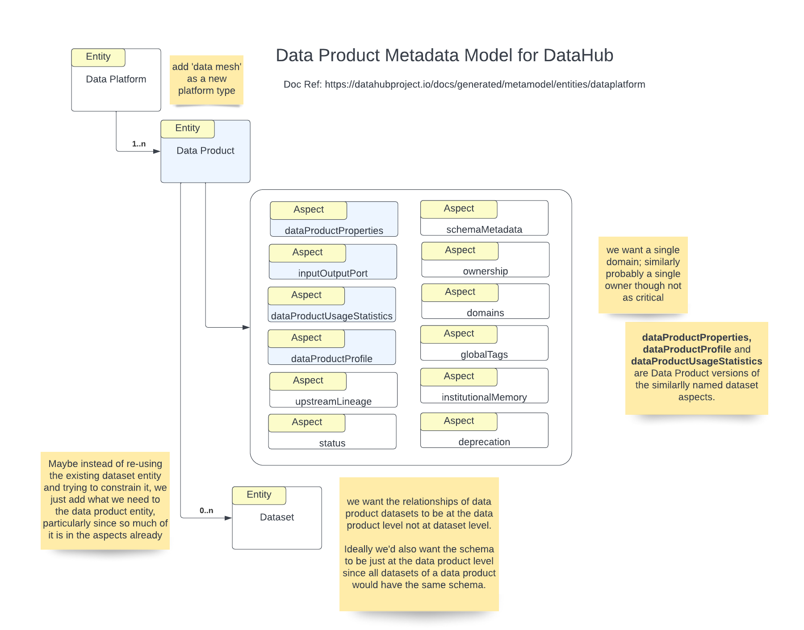

- Start Date: 2023-01-24
- RFC PR: [https://github.com/datahub-project/rfcs/pull/1](https://github.com/datahub-project/rfcs/pull/1)
- Discussion Issue: [Discussion on Slack](https://datahubspace.slack.com/archives/C03UV8BNXEW/p1673471786747339)
- Implementation PR(s): (leave this empty)

# Data Products Model

## Summary

There has been a lot of interest in the community over the past 6 months in creating a Data Product entity in the DataHub metadata model.
This is understandable, as a lot of Data Mesh implementations [1](https://optum.github.io/blog/2022/03/23/data-mesh-via-datahub/), [2](https://blog.datahubproject.io/enabling-data-discovery-in-a-data-mesh-the-saxo-journey-451b06969c8f) etc. are leveraging DataHub as the Data Discovery and Metadata solution.
This RFC attempts to first document all the ideas that have been proposed with attribution, before starting a discussion around convergence on a common model.

## Motivation

See Summary section.

## Suggested Principles for the Model
- Start with the slimmest model possible that accomplishes the MVP requirements. This will ensure that we broaden the model as we encounter new requirements versus over-designing it too early.

## MVP Requirements

TBD

## Emerging Consensus (Still up for debate)

- Data Products are 1:N with DataHub's notion of Datasets both for input and output
- There must be at least one output dataset for a Data Product
- Logical Datasets (some people call them Polyglot Datasets) are important to model as part of this effort. A single Data Product might export multiple logical datasets where each logical dataset can have physical variants stored in different platforms and expose a slightly different technical schema (e.g Logical Dataset that can be consumed over Kafka or Athena)
- Data Products can have a logical schema if they are encapsulating a single Logical Dataset with a common schema across the physical dataset variants, but in cases where an entire star schema is being represented as a Data Product, it might just be a collection of related datasets.

## Raw Discussion Log

Ray Suliteanu
I will share details when we have them, but at a high level here is what we’ve been thinking/considering

- add ‘data mesh’ as a new data platform type, to organize new data product entities; it seemed better than having the existing  container entity to organize them
- a new DataProduct entity
- a new inputOutputPort aspect
- new data product versions of the dataset aspects datasetProperties, datasetUsageStatistics, datasetProfile; alternatively maybe make those not tied to dataset.
- schemaMetadata on the data product entity; this is where things get a little interesting, since in my view the data product has a schema, and all datasets associated with the data product have the same schema, so how to address the fact that dataset currently has a schema as well?
a somewhat similar issue has to do with lineage since I believe the lineage is between data products, not datasets. 

So the general question is how to limit/constrain datasets that are part of the data product, without duplicating what’s there. I was originally thinking to have the new data product entity reference 0..n dataset entities. But maybe it would be better to not try and shoehorn the existing dataset entity and instead just have what the data product entity needs. Curious what peoples’ thoughts are on this, particularly given I’m very new to DH and not familiar with standards, guidelines, best practices
I would also like to have domains be singular for a data product i.e. a data product only belongs to one domain, and similarly ideally I was thinking that owners would be singular for a data product, though on that point I’m less concerned

Deepu Puthrote
Hi Ray thanks for this. Data Product -> 0..n Data sets is what we were thinking as well. It makes sense.
I have a concern about Schema being at the DataProduct level. How is that defined? Do we have to re-define schema at Data Product level? My concern is that this could go out of sync with the associated datasets.
For example a Customer Data Product published to a kafka-topic and ingested to a Apach Hudi table in datalake. In this scenario both datasets, one in kafka-topic and other in Hudi table will have the common schema attributes/fields of the Customer. But the dataset itself may have some extra fields for operational purposes, depending on the how and where it is. Apache Hudi dataset will have extra columns for example, so schema will be slightly different for Hudi dataset and the Kafka Topic.
It could be that the Schema at Data Product level will be common attributes/fields between the related datasets.
Kafka Schema --> ( Data Product Schema ) <-- Hudi Table Schema
Since the Schema is available at DataSet level, can we extract the common fields and display it at Data Product level, instead of having to define it again?

Ray
Thanks Deepu for the feedback. If I understand your example, the Customer Data Product is producing only to the Kafka topic. At that point, it’s responsibility ends. What any consumer does at that point is up to the consumer, whether another data product or a consumer outside the data mesh. If the consumer stores data in a Hudi table and modifies the schema to add some attributes specific to the Hudi-based use case, then that’s a new schema and has nothing to do with the original Consumer Data Product. If the consumer that’s using Hudi is in the mesh, then it’s another data product with its own schema.
But also keep in mind the difference between “data on the inside” and “data on the outside”. A data product is a black box as far as other producers and consumers are concerned. The data products stored in a discovery service and publishing a schema define the public “data on the outside” only. No one cares about the format of the “data on the inside”. So in your example, it could be that the consumption into Hudi table(s) with additional fields is only internal and the public schema is still the exact same customer schema that the Customer Data Product published.
That’s how I see it anyway, and why I have only one schema per data product. Note this is a logical schema and not a physical schema i.e. a data product could support returning a Protobuf IDL file or a GraphQL schema or whatever, for use by consumers of the data product, but they’re just different physical representations of the same schema.

Pedro Figueiredo
in my view the data product has a schema, and all datasets associated with the data product have the same schema
In my mind a data product could serve multiple datasets, e.g. where a data product is represented by a star schema, there will be several different datasets.
The next level down is a logical dataset, which represents a polyglot dataset (e.g. served both in Kafka and Athena, for example) where the schema is the same, you have two physical datasets (both IRL and in DataHub), but the logical dataset as an umbrella.
Since all the underlying schemata can be ingested from the datasets’ definitions, I would prefer not to have to declare it at the data product or logical dataset levels.

Ray Suliteanu
Hi Pedro, thanks, I see your point. One question or point that needs definition is what does “dataset” mean. Perhaps I’m being too narrow. The only thing I see as a dataset is a physical data file or files with a finite number of records. My reasoning being that anything else is not finite. I do not see a database table as a data set because the set may change. Certainly a Kafka topic (or other streaming system) does not represent a “set”.
That said, perhaps the question here is not so much about schemas vis a vis datasets, but whether a Data Product even has any datasets at all. To me, a Data Product has 1..n input ports and 1..n output ports. Everything exposed by the output ports shares the same (logical) schema and the only difference between output ports is the syntax of the schema specific to the type of output port. Datasets don’t even need to come into the picture. Maybe that simplifies the discussion? Or maybe blows it up? :slightly_smiling_face:

Pedro Figueiredo
a dataset is a physical data file or files with a finite number of records
This is intriguing, would love to talk more about it :slightly_smiling_face: As it is today, a dataset in DataHub can certainly be a database table or a Kafka topic. Datasets change - e.g. you serve a website activity summary with some periodicity, is it your view that there is a new dataset every period?

Pedro Figueiredo
To me a dataset can be an evolving collection of data, as long as records are immutable and you can navigate it temporally or otherwise it doesn’t really make a difference if it has stopped growing, or am I missing something?

Eric Yomi
https://github.com/ericyomi/datahub/tree/data-product-entity

### Extensibility

- TBD

## Non-Requirements

- TBD 

## Detailed design

TBD

## How we teach this

TBD

## Drawbacks

TBD

## Alternatives

TBD

## Rollout / Adoption Strategy

TBD

## Future Work

TBD

## Unresolved questions
